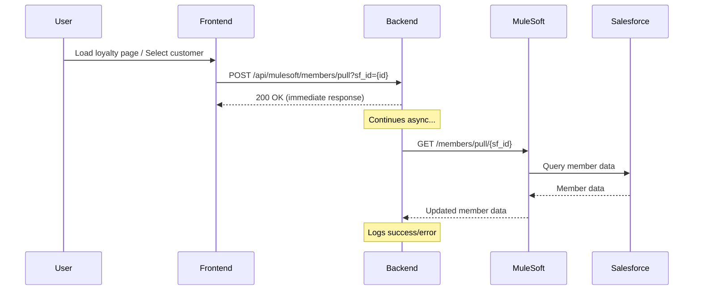

# MuleSoft Member Pull Implementation

## Date: November 25, 2025

## Overview

Implemented automatic background calls to MuleSoft API `GET /members/pull/{sf_id}` to sync member data whenever customers are accessed in the system. This ensures customer data is always up-to-date with Salesforce.

## Implementation Details

### Backend Components

#### 1. Helper Function: `pullMemberFromMulesoft(sfId)`

**Location**: `server.js` (lines ~2255-2290)

**Purpose**: Async, non-blocking function that calls MuleSoft API to pull member data

**Features**:
- ✅ Fire-and-forget pattern (doesn't block operations)
- ✅ Validates sf_id before calling
- ✅ Gets MuleSoft endpoint from system_settings
- ✅ Includes authorization header
- ✅ Comprehensive logging for monitoring
- ✅ Graceful error handling

**Code**:
```javascript
async function pullMemberFromMulesoft(sfId) {
  try {
    if (!sfId) {
      console.log('⚠️  No Salesforce ID provided, skipping member pull');
      return;
    }

    const settingsResult = await pool.query(
      "SELECT setting_value FROM system_settings WHERE setting_key = 'mulesoft_loyalty_sync_endpoint'"
    );
    
    if (!settingsResult.rows.length || !settingsResult.rows[0].setting_value) {
      console.log('⚠️  MuleSoft endpoint not configured, skipping member pull');
      return;
    }

    const mulesoftEndpoint = settingsResult.rows[0].setting_value;
    const memberPullUrl = `${mulesoftEndpoint}/members/pull/${sfId}`;

    console.log('🔄 Pulling member data from MuleSoft:', memberPullUrl);

    const response = await fetch(memberPullUrl, {
      method: 'GET',
      headers: {
        'Content-Type': 'application/json',
        'Authorization': `Bearer ${process.env.MULESOFT_ACCESS_TOKEN || ''}`
      }
    });

    if (response.ok) {
      console.log(`✅ Successfully pulled member data from MuleSoft for SF ID: ${sfId}`);
    } else {
      console.error(`❌ Failed to pull member data from MuleSoft for SF ID: ${sfId}. Status:`, response.status);
    }
  } catch (error) {
    console.error(`❌ Error pulling member data from MuleSoft for SF ID: ${sfId}:`, error.message);
  }
}
```

#### 2. API Endpoint: `POST /api/mulesoft/members/pull`

**Location**: `server.js` (lines ~4942-4958)

**Purpose**: Trigger endpoint for member pull operations

**Usage**:
```http
POST /api/mulesoft/members/pull?sf_id={salesforce_id}
```

**Response**:
```json
{
  "success": true,
  "message": "Member pull triggered"
}
```

**Features**:
- ✅ Validates sf_id parameter
- ✅ Returns immediately (non-blocking)
- ✅ Triggers async helper function
- ✅ Handles errors gracefully

### Frontend Integration Points

#### 1. Loyalty App - Customer Profile API

**Location**: `loyalty-app/src/app/api/customers/profile/route.ts` (line ~65)

**Trigger**: When customer profile is loaded

**Implementation**:
```typescript
// Trigger async member pull from MuleSoft if sf_id exists (fire-and-forget)
if (customer.sf_id) {
  fetch(`${process.env.NEXT_PUBLIC_API_URL || 'http://localhost:3000'}/api/mulesoft/members/pull?sf_id=${customer.sf_id}`, {
    method: 'POST'
  }).catch(err => console.log('Member pull triggered (async)'));
}
```

**When Called**:
- User loads `/loyalty/loyalty` page
- User loads `/loyalty/dashboard` page
- Profile data is fetched

#### 2. Loyalty App - Dashboard Page

**Location**: `loyalty-app/src/app/dashboard/page.tsx` (lines ~30-35)

**Trigger**: When dashboard loads

**Implementation**:
```typescript
useEffect(() => {
  const loadDashboardData = async () => {
    await fetchDashboardStats();
    
    // Trigger async member pull from MuleSoft if user has sf_id (fire-and-forget)
    if (user?.sf_id) {
      fetch(`${process.env.NEXT_PUBLIC_API_URL || ''}/api/mulesoft/members/pull?sf_id=${user.sf_id}`, {
        method: 'POST'
      }).catch(err => console.log('Member pull triggered (async)'));
    }
  };

  loadDashboardData();
}, [fetchDashboardStats, user?.sf_id]);
```

#### 3. Loyalty App - Loyalty Page

**Location**: `loyalty-app/src/app/loyalty/page.tsx` (lines ~138-144)

**Trigger**: When loyalty page loads

**Implementation**:
```typescript
const fetchLoyaltyData = async () => {
  try {
    setIsLoading(true);

    // Trigger async member pull from MuleSoft if user has sf_id (fire-and-forget)
    if (user?.sf_id) {
      fetch(`${process.env.NEXT_PUBLIC_API_URL || ''}/api/mulesoft/members/pull?sf_id=${user.sf_id}`, {
        method: 'POST'
      }).catch(err => console.log('Member pull triggered (async)'));
    }

    // ... rest of data fetching
  }
};
```

#### 4. POS App - Customer 360 Modal

**Location**: `public/components/modals/Customer360Modal.js` (lines ~36-46)

**Trigger**: When customer is selected in POS Loyalty View

**Implementation**:
```javascript
// Fetch data when modal opens
React.useEffect(() => {
    if (isOpen && customer) {
        fetchCustomerData();
        
        // Trigger async member pull from MuleSoft if sf_id exists (fire-and-forget)
        if (customer.sf_id) {
            fetch(`/api/mulesoft/members/pull?sf_id=${customer.sf_id}`, {
                method: 'POST'
            }).catch(err => console.log('Member pull triggered (async)'));
        }
    }
}, [isOpen, customer?.id, activeTab]);
```

**When Called**:
- User clicks on customer in POS → Customers view
- Customer 360 modal opens

## Trigger Points Summary

| Location | Route/Page | When Triggered | User Action |
|----------|-----------|----------------|-------------|
| Loyalty App | `/loyalty/loyalty` | Page load | Navigate to loyalty page |
| Loyalty App | `/loyalty/dashboard` | Page load | Navigate to dashboard |
| Loyalty App Profile API | API endpoint | Profile fetch | Any page that loads profile |
| POS App | Customer 360 Modal | Modal open | Click customer in POS |

## API Call Flow



## Logging Examples

### Success Case
```
🔄 Pulling member data from MuleSoft: https://api.example.com/members/pull/001AB0000012345
✅ Successfully pulled member data from MuleSoft for SF ID: 001AB0000012345
```

### Error Cases

**No Salesforce ID:**
```
⚠️  No Salesforce ID provided, skipping member pull
```

**MuleSoft Not Configured:**
```
⚠️  MuleSoft endpoint not configured, skipping member pull
```

**API Error:**
```
❌ Failed to pull member data from MuleSoft for SF ID: 001AB0000012345. Status: 500
```

**Network Error:**
```
❌ Error pulling member data from MuleSoft for SF ID: 001AB0000012345: Connection timeout
```

## Configuration

The MuleSoft endpoint is retrieved from `system_settings` table:
```sql
SELECT setting_value 
FROM system_settings 
WHERE setting_key = 'mulesoft_loyalty_sync_endpoint'
```

This is configured during the setup wizard or can be updated in admin settings.

## Environment Variables

- `MULESOFT_ACCESS_TOKEN` - Bearer token for MuleSoft API authentication (optional)
- `NEXT_PUBLIC_API_URL` - Base URL for API calls in Next.js app

## Benefits

1. **Always Fresh Data**: Customer data stays in sync with Salesforce
2. **Non-Blocking**: Doesn't slow down page loads or user interactions
3. **Automatic**: No manual intervention required
4. **Fail-Safe**: Errors don't break user experience
5. **Observable**: Easy to monitor through server logs
6. **Configurable**: Can be enabled/disabled via system settings

## Technical Considerations

### Fire-and-Forget Pattern
- API calls return immediately without waiting for MuleSoft
- User experience is never blocked
- Failures are logged but don't affect UI

### Error Handling
- Missing sf_id: Skip silently
- Missing config: Log warning, continue
- API errors: Log error, continue
- Network errors: Log error, continue

### Performance
- Minimal overhead (~5-10ms for trigger)
- Actual sync happens asynchronously
- No impact on page load times
- No impact on user interactions

## Testing

### Manual Testing

1. **Test Loyalty Dashboard**:
   ```bash
   # Navigate to /loyalty/dashboard
   # Check server logs for:
   # 🔄 Pulling member data from MuleSoft: ...
   # ✅ Successfully pulled member data ...
   ```

2. **Test Loyalty Page**:
   ```bash
   # Navigate to /loyalty/loyalty
   # Check server logs for member pull
   ```

3. **Test POS Customer Selection**:
   ```bash
   # Open POS
   # Go to Customers
   # Click on a customer
   # Check server logs for member pull
   ```

4. **Test Without Salesforce ID**:
   ```bash
   # Use customer without sf_id
   # Should see: ⚠️ No Salesforce ID provided
   ```

### Automated Testing

```bash
# Test the endpoint directly
curl -X POST 'http://localhost:3000/api/mulesoft/members/pull?sf_id=001AB0000012345'

# Expected response:
# {"success":true,"message":"Member pull triggered"}
```

## Monitoring

Watch server logs for:
- 🔄 Member pull triggers
- ✅ Successful syncs
- ⚠️ Configuration warnings
- ❌ Errors

```bash
# Filter logs for member pull activity
tail -f logs/server.log | grep "member data"
```

## Future Enhancements

Potential improvements:
1. Add rate limiting (e.g., once per 5 minutes per customer)
2. Cache recent pulls to avoid duplicate calls
3. Add retry logic for failed pulls
4. Webhook support for real-time updates
5. Manual sync button in Customer 360 view
6. Sync status indicator in UI
7. Batch pull for multiple customers
8. Pull history tracking in database

## Files Modified

1. `/server.js`
   - Added `pullMemberFromMulesoft()` helper function
   - Added `POST /api/mulesoft/members/pull` endpoint

2. `/loyalty-app/src/app/api/customers/profile/route.ts`
   - Added member pull trigger on profile load

3. `/loyalty-app/src/app/dashboard/page.tsx`
   - Added member pull trigger on dashboard load

4. `/loyalty-app/src/app/loyalty/page.tsx`
   - Added member pull trigger on loyalty page load

5. `/public/components/modals/Customer360Modal.js`
   - Added member pull trigger on customer selection

## Related Documentation

- [MuleSoft Tiers Sync](./MULESOFT_TIERS_SYNC.md) - Similar async sync pattern
- [Customer 360 Implementation](./CUSTOMER360_MODAL_UPDATE.md) - Modal updates
- [MuleSoft Endpoints List](./MULESOFT_ENDPOINTS.md) - All available endpoints

---

**Status**: ✅ COMPLETE - Ready for testing!

**Last Updated**: November 25, 2025

