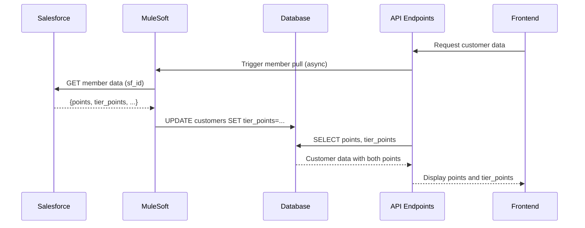

# Tier Points Implementation

## Date: November 25, 2025

## Overview

Added `tier_points` column to the customers table and updated all services, APIs, and database views to support tracking and displaying tier points alongside regular loyalty points. MuleSoft will populate this field when syncing customer data from Salesforce.

## Database Changes

### 1. Customer Table Schema Update

**Location**: `db/database.sql` (line ~151)

**Added Column**:
```sql
tier_points INTEGER DEFAULT 0
```

**Full Schema**:
```sql
CREATE TABLE customers (
    id SERIAL PRIMARY KEY,
    loyalty_number VARCHAR(20) UNIQUE NOT NULL,
    first_name VARCHAR(100),
    last_name VARCHAR(100),
    name VARCHAR(255) NOT NULL,
    email VARCHAR(255),
    phone VARCHAR(20),
    points INTEGER DEFAULT 0,
    tier_points INTEGER DEFAULT 0,  -- ✅ NEW FIELD
    total_spent DECIMAL(10,2) DEFAULT 0.00,
    visit_count INTEGER DEFAULT 0,
    ...
);
```

### 2. Migration for Existing Databases

**Location**: `db/database.sql` (line ~1498)

**ALTER TABLE Statement**:
```sql
ALTER TABLE customers ADD COLUMN IF NOT EXISTS tier_points INTEGER DEFAULT 0;
```

This ensures existing databases get the new column without breaking.

### 3. Database Views Updated

**a) customer_loyalty_dashboard View**

**Location**: `db/database.sql` (line ~1087)

Added `c.tier_points` to the SELECT statement.

**b) enhanced_customer_dashboard View (Both instances)**

**Location**: `db/database.sql` (lines ~2463 and ~3637)

Added `c.tier_points` to both occurrences of this view.

## API Endpoints Updated

### Loyalty App APIs

#### 1. Customer Profile API

**File**: `loyalty-app/src/app/api/customers/profile/route.ts`

**Changes**:
- Added `c.tier_points` to SELECT query (line ~25)
- Added `tier_points: customer.tier_points` to response (line ~78)

**Endpoint**: `GET /loyalty/api/customers/profile`

**Response Format**:
```typescript
{
  customer: {
    points: number,
    tier_points: number,  // ✅ NEW
    total_spent: number,
    // ... other fields
  }
}
```

#### 2. Loyalty Points API

**File**: `loyalty-app/src/app/api/loyalty/points/route.ts`

**Changes**:
- Added `c.tier_points` to SELECT query (line ~21)
- Added `tierPoints: customer.tier_points || 0` to response (line ~78)

**Endpoint**: `GET /loyalty/api/loyalty/points`

**Response Format**:
```typescript
{
  currentBalance: number,
  tierPoints: number,  // ✅ NEW
  totalEarned: number,
  totalRedeemed: number,
  // ... other fields
}
```

#### 3. Dashboard Stats API

**File**: `loyalty-app/src/app/api/dashboard/stats/route.ts`

**Changes**:
- Added `tier_points` to SELECT query (line ~18)
- Added `tierPoints: customer.tier_points || 0` to response (line ~92)

**Endpoint**: `GET /loyalty/api/dashboard/stats`

**Response Format**:
```typescript
{
  points: number,
  tierPoints: number,  // ✅ NEW
  totalSpent: number,
  // ... other fields
}
```

#### 4. Auth Login API

**File**: `loyalty-app/src/app/api/auth/login/route.ts`

**Changes**:
- Added `c.tier_points` to SELECT query (line ~134)
- Added `tierPoints: fullUser.tier_points || 0` to user response (line ~158)
- Added `sf_id: fullUser.sf_id` to user response (for MuleSoft sync)

**Endpoint**: `POST /loyalty/api/auth/login`

**Response Format**:
```typescript
{
  user: {
    points: number,
    tierPoints: number,  // ✅ NEW
    sf_id: string,       // ✅ NEW (for MuleSoft)
    // ... other fields
  }
}
```

#### 5. Auth Me API (Session Check)

**File**: `loyalty-app/src/app/api/auth/me/route.ts`

**Changes**:
- Added `c.tier_points` to SELECT query (line ~24)
- Added `tierPoints: user.tier_points || 0` to userData (line ~49)
- Added `sf_id: user.sf_id` to userData

**Endpoint**: `GET /loyalty/api/auth/me`

**Response Format**:
```typescript
{
  user: {
    points: number,
    tierPoints: number,  // ✅ NEW
    sf_id: string,       // ✅ NEW
    // ... other fields
  }
}
```

## Files Modified

| File | Changes | Lines |
|------|---------|-------|
| `db/database.sql` | Added tier_points column to customers table | ~151 |
| `db/database.sql` | Added ALTER TABLE for migration | ~1498 |
| `db/database.sql` | Updated customer_loyalty_dashboard view | ~1087 |
| `db/database.sql` | Updated enhanced_customer_dashboard view (1st) | ~2463 |
| `db/database.sql` | Updated enhanced_customer_dashboard view (2nd) | ~3637 |
| `loyalty-app/src/app/api/customers/profile/route.ts` | Added tier_points to SELECT and response | ~25, ~78 |
| `loyalty-app/src/app/api/loyalty/points/route.ts` | Added tier_points to SELECT and response | ~21, ~78 |
| `loyalty-app/src/app/api/dashboard/stats/route.ts` | Added tier_points to SELECT and response | ~18, ~92 |
| `loyalty-app/src/app/api/auth/login/route.ts` | Added tier_points and sf_id to user data | ~134, ~158 |
| `loyalty-app/src/app/api/auth/me/route.ts` | Added tier_points and sf_id to user data | ~24, ~49 |

## MuleSoft Integration

### Expected Behavior

When MuleSoft calls `GET /members/pull/{sf_id}`:
1. MuleSoft retrieves member data from Salesforce
2. Salesforce returns both `points` and `tier_points`
3. MuleSoft updates the local database with both values
4. Frontend automatically displays both point types

### Data Flow



## Database Migration

### For Existing Databases

Run the migration to add the column:

```sql
ALTER TABLE customers ADD COLUMN IF NOT EXISTS tier_points INTEGER DEFAULT 0;
```

This is **safe to run multiple times** and will:
- Add the column if it doesn't exist
- Set default value of 0 for all existing customers
- Do nothing if column already exists

### For New Databases

The column is included in the `CREATE TABLE` statement, so no migration needed.

## API Response Examples

### Before (Without tier_points)
```json
{
  "customer": {
    "id": 123,
    "name": "John Doe",
    "points": 1500,
    "total_spent": 5000
  }
}
```

### After (With tier_points)
```json
{
  "customer": {
    "id": 123,
    "name": "John Doe",
    "points": 1500,
    "tier_points": 250,
    "total_spent": 5000
  }
}
```

## Frontend Integration (To Be Implemented)

The backend is now ready to support tier points. Frontend tasks include:

### 1. Update TypeScript Interfaces

```typescript
interface Customer {
  points: number;
  tier_points: number;  // Add this field
  // ... other fields
}

interface PointsData {
  currentBalance: number;
  tierPoints: number;  // Add this field
  // ... other fields
}
```

### 2. Display Tier Points in UI

**Dashboard Page**:
```tsx
<div className="stat-card">
  <h3>Loyalty Points</h3>
  <p>{user.points}</p>
</div>
<div className="stat-card">
  <h3>Tier Points</h3>
  <p>{user.tierPoints}</p>
</div>
```

**Loyalty Page**:
```tsx
<div className="points-display">
  <div>
    <span>Regular Points:</span>
    <strong>{pointsData.currentBalance}</strong>
  </div>
  <div>
    <span>Tier Points:</span>
    <strong>{pointsData.tierPoints}</strong>
  </div>
</div>
```

**Profile Page**:
```tsx
<div className="profile-stats">
  <StatCard 
    label="Loyalty Points" 
    value={customer.points} 
  />
  <StatCard 
    label="Tier Points" 
    value={customer.tier_points} 
  />
</div>
```

### 3. Update Context/State

If using React Context or state management:

```typescript
const [user, setUser] = useState<User>({
  points: 0,
  tierPoints: 0,  // Add this
  // ... other fields
});
```

## Testing

### 1. Database Migration Test

```sql
-- Check if column exists
SELECT column_name, data_type, column_default
FROM information_schema.columns
WHERE table_name = 'customers' AND column_name = 'tier_points';

-- Expected result:
-- column_name | data_type | column_default
-- tier_points | integer   | 0
```

### 2. API Response Test

```bash
# Test profile API
curl -X GET 'http://localhost:3000/loyalty/api/customers/profile' \
  -H 'Cookie: auth-token=...'

# Expected response includes:
# {
#   "customer": {
#     "points": 1500,
#     "tier_points": 0,  // Should be present
#     ...
#   }
# }
```

### 3. MuleSoft Sync Test

```bash
# Trigger member pull
curl -X POST 'http://localhost:3000/api/mulesoft/members/pull?sf_id=001AB...'

# Check database was updated
psql -d your_database -c "SELECT name, points, tier_points FROM customers WHERE sf_id = '001AB...';"
```

### 4. View Test

```sql
-- Test customer_loyalty_dashboard view
SELECT id, name, points, tier_points 
FROM customer_loyalty_dashboard 
LIMIT 5;

-- Should return both points columns
```

## Benefits

1. **Dual Point System**: Support for both regular loyalty points and tier-specific points
2. **MuleSoft Ready**: Backend fully prepared for MuleSoft sync
3. **Backward Compatible**: Existing queries still work with default value of 0
4. **Consistent API**: All endpoints return tier_points alongside points
5. **Database Views Updated**: Views reflect the new field automatically
6. **Migration Safe**: ALTER TABLE uses IF NOT EXISTS to prevent errors

## Next Steps

1. **Frontend Implementation**: Update UI components to display tier_points
2. **MuleSoft Configuration**: Ensure MuleSoft API returns tier_points from Salesforce
3. **Business Logic**: Define rules for earning and using tier points
4. **Documentation**: Add tier points explanation to user-facing docs
5. **Analytics**: Add tier points tracking to analytics/reporting

## Notes

- Default value is `0` for all tier_points
- Column accepts `NULL` but defaults to `0`
- Frontend needs updating to display the new field (not included in this commit)
- MuleSoft will populate tier_points when syncing customer data
- All API responses now include `tierPoints` field (default 0 if not set)

---

**Status**: ✅ Backend Complete - Ready for Frontend Implementation

**Last Updated**: November 25, 2025

